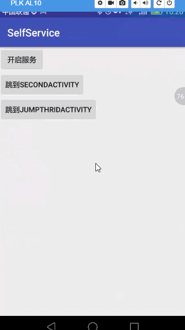

最近有一个项目要求实现一个Service与多个Activity实现通信，最后在这里写一个小Demo来实现

实现有两种方式

方式一，通后广播来实现，可以解耦

方式二，通过观察者模式来实现

就让我们来看看这两种方式的实现

我这里实现一个小小的计数功能，在MainActivity开启服务，然后可以跳到SecondActivity,ThridActivity

其不的SecondActivity采用是广播方式来监听服务的，ThridActivity采用观察者方式来订阅服务
效果图

博客地址 [http://www.iblogstreet.com/2017/05/21/android-service-activity-communication.html](http://www.iblogstreet.com/2017/05/21/android-service-activity-communication.html)